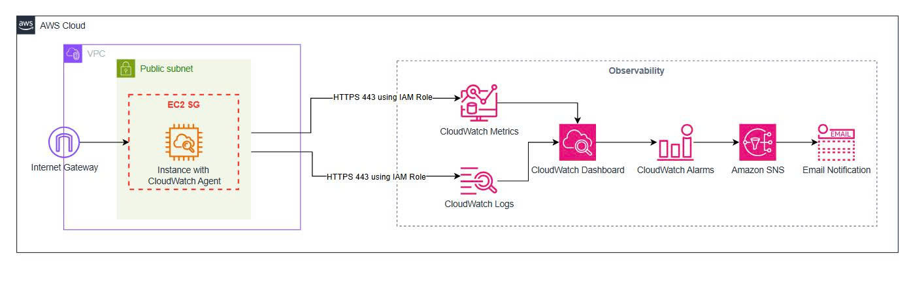

# AWS-native Observability for EC2 with CloudWatch Agent - Lab Evidence

## 1. Tổng quan bài lab

### Tên bài lab

AWS-native Observability for EC2 with CloudWatch Agent

### Mục tiêu

Bài lab này thực hành triển khai observability theo hướng AWS-native cho EC2 bằng CloudWatch Agent.

Mục tiêu chính:

- Cài đặt CloudWatch Agent trên EC2.
- Thu thập system metrics như memory, disk, CPU.
- Thu thập application/system logs từ EC2.
- Gửi metrics về CloudWatch Metrics.
- Gửi logs về CloudWatch Logs.
- Tạo CloudWatch Dashboard để quan sát.
- Tạo CloudWatch Alarm để cảnh báo.
- Gửi cảnh báo qua Amazon SNS Email.
- Ghi lại evidence để sử dụng cho bài blog kỹ thuật.

### Kiến trúc tổng quan
----

----

### Phạm vi bài lab

Trong bài lab này, mình sẽ làm 2 case:

```text
Case 1:
Một EC2 đã có sẵn, chưa từng cài CloudWatch Agent.
Mục tiêu: thêm CloudWatch Agent vào EC2 hiện tại.

Case 2:
Tạo một EC2 mới từ đầu và cài CloudWatch Agent ngay từ lúc launch.
Mục tiêu: bootstrap CloudWatch Agent bằng user data.
```

### Các AWS service sử dụng

| Service | Vai trò |
|---|---|
| Amazon EC2 | Máy chủ chạy workload |
| Amazon CloudWatch Agent | Thu thập logs và metrics |
| CloudWatch Metrics | Lưu system/custom metrics |
| CloudWatch Logs | Lưu logs từ EC2 |
| CloudWatch Dashboard | Hiển thị metrics/logs |
| CloudWatch Alarms | Cảnh báo khi vượt ngưỡng |
| Amazon SNS | Gửi email notification |
| IAM Role | Cấp quyền cho EC2 gửi data lên CloudWatch |
| AWS Systems Manager | Truy cập EC2 và quản lý agent theo hướng AWS-native |
| Parameter Store | Lưu CloudWatch Agent config, nếu sử dụng |

---

# Case 1: Cài CloudWatch Agent trên EC2 đã có sẵn

## 2. Case 1 - Mục tiêu

Trong case này, mình giả định đã có một EC2 instance đang chạy nhưng chưa từng cài CloudWatch Agent.

Mục tiêu là thêm observability vào EC2 hiện tại mà không cần tạo lại instance.

Flow thực hiện:

```text
Existing EC2
→ Attach IAM Role
→ Cài Nginx nếu cần
→ Cài CloudWatch Agent
→ Tạo CloudWatch Agent config
→ Start CloudWatch Agent
→ Kiểm tra Metrics và Logs trên CloudWatch
→ Tạo Alarm, SNS, Dashboard
```

---

## 3. Case 1 - Step 1: Kiểm tra EC2 hiện tại

### Mục tiêu

Xác nhận EC2 instance đang chạy và sẵn sàng để cài CloudWatch Agent.

### Thao tác

- Vào AWS Console.
- Mở EC2.
- Chọn instance sẽ dùng cho bài lab.
- Kiểm tra trạng thái instance là `Running`.
- Kiểm tra AMI/OS, ví dụ Amazon Linux 2023.
- Kiểm tra subnet là public subnet.
- Kiểm tra public IPv4 nếu cần test HTTP.

### Kết quả mong đợi

EC2 instance đang chạy ổn định.

### Evidence


### Ghi chú

```text
Instance ID: i-004d22f414fe421f0
Instance name: cwagent-existing-ec2
AMI: Amazon Linux 2023
Instance type: t3.micro
VPC: CW-Agent-Ec2-vpc
Subnet: CW-Agent-Ec2-subnet-public1-us-east-1a
Public IPv4: 100.58.240.65
Private IPv4: 10.0.15.202
IAM Role: ec2-cloudwatch-agent-role
State: Running
```

---

## 4. Case 1 - Step 2: Attach IAM Role cho EC2

### Mục tiêu

Gắn IAM Role vào EC2 để CloudWatch Agent có quyền gửi logs và metrics về CloudWatch.

### IAM Role sử dụng

Tên role đề xuất:

```text
ec2-cloudwatch-agent-role
```

Managed policies cần attach:

```text
CloudWatchAgentServerPolicy
AmazonSSMManagedInstanceCore
```

### Ý nghĩa

```text
CloudWatchAgentServerPolicy:
Cho phép CloudWatch Agent gửi metrics/logs lên CloudWatch.

AmazonSSMManagedInstanceCore:
Cho phép EC2 hoạt động với AWS Systems Manager.
```

### Thao tác

- Vào IAM.
- Tạo role cho EC2.
- Attach 2 policy ở trên.
- Quay lại EC2.
- Chọn instance.
- Actions → Security → Modify IAM Role.
- Chọn role `ec2-cloudwatch-agent-role`.

### Kết quả mong đợi

EC2 đã được attach IAM Role đúng.

### Evidence


---

## 5. Case 1 - Step 3: Kiểm tra EC2 trong Systems Manager

### Mục tiêu

Xác nhận EC2 có thể được quản lý bằng AWS Systems Manager.

### Thao tác

- Vào AWS Systems Manager.
- Mở Fleet Manager hoặc Managed Nodes.
- Kiểm tra instance có xuất hiện trong danh sách managed node hay không.

### Kết quả mong đợi

EC2 xuất hiện trong Systems Manager Managed Nodes.

### Evidence


### Ghi chú
```
EC2 `cwagent-existing-ec2` đã xuất hiện trong AWS Systems Manager Fleet Manager với trạng thái:

- Node state: Running
- Ping status: Online
- Platform type: Linux
- Operating system: Amazon Linux
- Resource type: EC2 instance
```

---

## 6. Case 1 - Step 4: kiểm tra Nginx và CloudWatch Agent
## Kết nối vào EC2 từ máy local bằng AWS Systems Manager Session Manager

### Mục tiêu

Kết nối từ terminal máy local vào EC2 bằng AWS Systems Manager Session Manager thay vì SSH.

Trong bài lab này, mình không mở port SSH `22` trên Security Group. Thay vào đó, mình sử dụng Session Manager để truy cập EC2 theo hướng AWS-native hơn.

Luồng kết nối:

```text
Local terminal
→ AWS CLI
→ AWS Systems Manager Session Manager
→ EC2 instance
```

Cách này giúp:

- Không cần mở SSH ra Internet.
- Không cần sử dụng key pair.
- Giảm rủi ro bảo mật so với việc mở port `22`.
- Dễ quản lý truy cập thông qua IAM và Systems Manager.

---

### Điều kiện cần có

Trước khi kết nối từ máy local vào EC2, cần đảm bảo:

- EC2 đã được attach IAM Role phù hợp.
- IAM Role có policy `AmazonSSMManagedInstanceCore`.
- EC2 đã xuất hiện trong Systems Manager Managed Nodes với trạng thái `Online`.
- Máy local đã cài AWS CLI.
- Máy local đã cấu hình AWS credentials.
- Máy local đã cài Session Manager Plugin.
- Region đang dùng đúng với region của EC2.

---

### Kiểm tra AWS CLI trên máy local

Chạy lệnh sau trên terminal máy local:

```bash
aws --version
```

Kết quả mong đợi:

```text
aws-cli/2.x.x
```

---

### Cấu hình AWS CLI nếu chưa cấu hình

Nếu máy local chưa cấu hình AWS credentials, chạy:

```bash
aws configure
```

Nhập các thông tin cần thiết:

```text
AWS Access Key ID: <access-key-của-bạn>
AWS Secret Access Key: <secret-key-của-bạn>
Default region name: us-east-1
Default output format: json
```

Trong bài lab này, region sử dụng là:

```text
us-east-1
```

---

### Kiểm tra AWS identity

Chạy lệnh:

```bash
aws sts get-caller-identity
```

Kết quả mong đợi là AWS CLI trả về thông tin account, user hoặc role đang được sử dụng.

Ví dụ:

```json
{
  "UserId": "EXAMPLEUSERID",
  "Account": "123456789012",
  "Arn": "arn:aws:iam::123456789012:user/example-user"
}
```

---

### Kiểm tra Session Manager Plugin

Chạy:

```bash
session-manager-plugin
```

Nếu Session Manager Plugin đã được cài, terminal sẽ hiển thị thông tin usage hoặc version.

Nếu chưa cài plugin, cần cài thêm Session Manager Plugin theo hệ điều hành đang sử dụng.

---

### Kết nối vào EC2 bằng Session Manager

Sử dụng lệnh sau từ terminal máy local:

```bash
aws ssm start-session \
  --target <id-instance-ec2-của-bạn> \
  --region us-east-1
```

Ví dụ:

```bash
aws ssm start-session \
  --target i-xxxxxxxxxxxxxxxxx \
  --region us-east-1
```

Kết quả mong đợi:

```text
Starting session with SessionId: ...
sh-5.2$
```

Khi thấy shell xuất hiện, nghĩa là đã kết nối thành công vào EC2.

---

### Chuyển sang quyền root

Session Manager thường đăng nhập bằng user `ssm-user`. Để thao tác dễ hơn trong bài lab, chuyển sang quyền root:

```bash
sudo su -
```

Kiểm tra user hiện tại:

```bash
whoami
```

Kết quả mong đợi:

```text
root
```

---

### Kiểm tra thông tin EC2 sau khi kết nối

Chạy các lệnh sau:

```bash
hostname
cat /etc/os-release
```

Kết quả mong đợi:

- Hostname hiển thị private DNS hoặc hostname của EC2.
- OS là Amazon Linux 2023 nếu bạn dùng đúng AMI trong bài lab.

---
### Ghi chú troubleshooting

Nếu không kết nối được bằng Session Manager, cần kiểm tra lại:

- EC2 đã attach IAM Role có `AmazonSSMManagedInstanceCore` chưa.
- EC2 có xuất hiện trong Systems Manager Managed Nodes chưa.
- Ping status của managed node có phải `Online` không.
- EC2 có outbound internet hoặc đường đi tới Systems Manager endpoint không.
- AWS CLI local có đúng region không.
- Máy local đã cài Session Manager Plugin chưa.

### Kết quả kiểm tra ban đầu

Mình đã kết nối vào EC2 bằng Systems Manager Session Manager và kiểm tra môi trường hiện tại.

Kết quả:

- User hiện tại: `root`
- Hostname: `ip-10-0-15-202.ec2.internal`
- OS: Amazon Linux 2023
- Nginx: active running
- CloudWatch Agent: chưa được cài đặt

Điều này xác nhận EC2 đang mô phỏng đúng tình huống "existing EC2": instance đã có workload Nginx chạy sẵn nhưng chưa có CloudWatch Agent.
# Evidence


---

## 7. Case 1 - Step 5: Cài CloudWatch Agent

### Mục tiêu

Cài đặt CloudWatch Agent package trên EC2.

### Command

```bash
sudo dnf install -y amazon-cloudwatch-agent
```

### Kiểm tra package

```bash
rpm -qa | grep amazon-cloudwatch-agent
```

### Kết quả mong đợi

CloudWatch Agent đã được cài thành công.

### Evidence


---

## 8. Case 1 - Step 6: Tạo CloudWatch Agent config

### Mục tiêu

Tạo file config để CloudWatch Agent biết cần thu thập metrics và logs nào.

### File config

Đường dẫn:

```text
/opt/aws/amazon-cloudwatch-agent/etc/amazon-cloudwatch-agent.json
```

### Config mẫu

[Case 1 - File Agent Config](./scripts/case1-cloudwatch-agent-config.json)

### Command tạo file

```bash
sudo tee /opt/aws/amazon-cloudwatch-agent/etc/amazon-cloudwatch-agent.json > /dev/null <<'CONFIG_EOF'
{
  "agent": {
    "metrics_collection_interval": 60,
    "run_as_user": "root"
  },
  "metrics": {
    "namespace": "CWAgent",
    "append_dimensions": {
      "InstanceId": "${aws:InstanceId}"
    },
    "metrics_collected": {
      "mem": {
        "measurement": [
          "mem_used_percent"
        ],
        "metrics_collection_interval": 60
      },
      "disk": {
        "measurement": [
          "used_percent"
        ],
        "metrics_collection_interval": 60,
        "resources": [
          "/"
        ]
      },
      "cpu": {
        "measurement": [
          "usage_idle",
          "usage_user",
          "usage_system"
        ],
        "metrics_collection_interval": 60,
        "totalcpu": true
      },
      "procstat": [
        {
          "exe": "nginx",
          "measurement": [
            "pid_count",
            "cpu_usage",
            "memory_rss"
          ],
          "metrics_collection_interval": 60
        }
      ]
    }
  },
  "logs": {
    "logs_collected": {
      "files": {
        "collect_list": [
          {
            "file_path": "/var/log/messages",
            "log_group_name": "/ec2/cloudwatch-agent/system",
            "log_stream_name": "{instance_id}-messages",
            "timezone": "UTC"
          },
          {
            "file_path": "/var/log/nginx/access.log",
            "log_group_name": "/ec2/cloudwatch-agent/nginx/access",
            "log_stream_name": "{instance_id}-access",
            "timezone": "UTC"
          },
          {
            "file_path": "/var/log/nginx/error.log",
            "log_group_name": "/ec2/cloudwatch-agent/nginx/error",
            "log_stream_name": "{instance_id}-error",
            "timezone": "UTC"
          }
        ]
      }
    }
  }
}
CONFIG_EOF
```

### Kiểm tra file

```bash
sudo cat /opt/aws/amazon-cloudwatch-agent/etc/amazon-cloudwatch-agent.json
```

### Evidence


---

## 9. Case 1 - Step 7: Start CloudWatch Agent

### Mục tiêu

Start CloudWatch Agent với config vừa tạo.

### Command

```bash
sudo /opt/aws/amazon-cloudwatch-agent/bin/amazon-cloudwatch-agent-ctl \
  -a fetch-config \
  -m ec2 \
  -c file:/opt/aws/amazon-cloudwatch-agent/etc/amazon-cloudwatch-agent.json \
  -s
```

### Kiểm tra trạng thái

```bash
sudo /opt/aws/amazon-cloudwatch-agent/bin/amazon-cloudwatch-agent-ctl -m ec2 -a status
sudo systemctl status amazon-cloudwatch-agent
```

### Kết quả mong đợi

CloudWatch Agent đang running.

### Evidence


---

## 10. Case 1 - Step 8: Kiểm tra CloudWatch Metrics

### Mục tiêu

Xác nhận metrics từ EC2 đã được gửi lên CloudWatch.

### Thao tác

- Vào CloudWatch Console.
- Chọn Metrics.
- Tìm namespace:

```text
CWAgent
```

- Kiểm tra các metric:

```text
mem_used_percent
disk_used_percent
procstat_pid_count
```

### Kết quả mong đợi

CloudWatch Metrics hiển thị metrics từ EC2.

### Evidence


---

## 11. Case 1 - Step 9: Kiểm tra CloudWatch Logs

### Mục tiêu

Xác nhận logs từ EC2 đã được gửi lên CloudWatch Logs.

### Thao tác

- Vào CloudWatch Console.
- Chọn Logs → Log management.
- Kiểm tra các log group:

```text
/ec2/cloudwatch-agent/nginx/access
/ec2/cloudwatch-agent/nginx/error
```

### Kết quả mong đợi

Có log stream mới được tạo từ EC2 instance.

### Evidence


---

## 12. Case 1 - Step 10: Tạo CloudWatch Alarm

### Mục tiêu

Tạo alarm để cảnh báo khi disk hoặc memory vượt ngưỡng.

### Alarm đề xuất

```text
Metric: mem_used_percent
Namespace: CWAgent
Condition: Greater than 80
Period: 1 minute
Evaluation period: 1
Action: Send notification to SNS topic
```

Hoặc:

```text
Metric: disk_used_percent
Namespace: CWAgent
Condition: Greater than 80
Period: 1 minute
Evaluation period: 1
Action: Send notification to SNS topic
```

### Kết quả mong đợi

CloudWatch Alarm được tạo thành công.

### Evidence


---

## 13. Case 1 - Step 11: Tạo SNS Email Notification

### Mục tiêu

Tạo SNS topic và email subscription để nhận cảnh báo từ CloudWatch Alarm.

### Thao tác

- Vào Amazon SNS.
- Tạo topic.
- Tạo subscription protocol Email.
- Nhập email nhận cảnh báo.
- Mở email và confirm subscription.

### Kết quả mong đợi

SNS subscription ở trạng thái `Confirmed`.

### Evidence


---

## 14 Case 1 - Step 11: Tạo CloudWatch Dashboard

### Mục tiêu

Tạo CloudWatch Dashboard để hiển thị các metric quan trọng được CloudWatch Agent thu thập từ EC2.

### Dashboard name

`cwagent-existing-ec2-dashboard`

### Metrics hiển thị

- `mem_used_percent`: Memory Used Percent
- `disk_used_percent`: Disk Used Percent
- `procstat_lookup_pid_count`: Nginx Process Count

### Kết quả

Dashboard đã hiển thị thành công 3 chỉ số chính của EC2 `cwagent-existing-ec2`:

- Memory Used Percent: khoảng `25.3%`
- Nginx Process Count: `3`
- Disk Used Percent: khoảng `23.9%`

Điều này chứng minh CloudWatch Agent đã gửi metrics thành công về CloudWatch và các metrics này có thể được visualize bằng CloudWatch Dashboard.

### Evidence


---

# Case 2: Tạo EC2 mới và cài CloudWatch Agent từ đầu

## 15. Case 2 - Mục tiêu

Trong case này, mình tạo một EC2 instance mới từ đầu và cài CloudWatch Agent ngay trong quá trình launch bằng User Data.

Flow:

```text
Launch new EC2
→ Attach IAM Role
→ User Data installs Nginx
→ User Data installs CloudWatch Agent
→ User Data writes config
→ User Data starts CloudWatch Agent
→ Verify Metrics and Logs
```

---

## 16. Case 2 - Step 1: Chuẩn bị IAM Role

### Mục tiêu

Sử dụng lại IAM Role đã tạo ở Case 1.

### IAM Role

```text
ec2-cloudwatch-agent-role
```

Policies:

```text
CloudWatchAgentServerPolicy
AmazonSSMManagedInstanceCore
```

### Evidence


---

## 17. Case 2 - Step 2: Chuẩn bị User Data

### Mục tiêu

Tự động cài Nginx, CloudWatch Agent, tạo config và start agent khi EC2 mới được launch.

### User Data mẫu

[Case 2 - User Data Script](./scripts/case2-user-data.sh)


---

## 18. Case 2 - Step 3: Launch EC2 mới

### Mục tiêu

Tạo EC2 mới từ đầu và gắn user data ở bước launch.

### Cấu hình EC2 đề xuất

```text
AMI: Amazon Linux 2023
Instance type: t2.micro hoặc t3.micro
Subnet: Public subnet
Auto-assign public IP: Enable
IAM Role: ec2-cloudwatch-agent-role
Security Group:
  - HTTP 80 from My IP hoặc 0.0.0.0/0 nếu lab nhanh
  - No SSH nếu dùng SSM
  - Outbound allow all
User Data: script ở Step 2
```

### Evidence

```markdown

```

---

## 19. Case 2 - Step 4: Kiểm tra EC2 mới đang chạy

### Mục tiêu

Xác nhận EC2 mới được tạo thành công.

### Thao tác

- Vào EC2 Console.
- Kiểm tra instance state là `Running`.
- Kiểm tra status check là `3/3 checks passed`.

### Evidence


---

## 20. Case 2 - Step 5: Kiểm tra CloudWatch Agent

### Mục tiêu

Xác nhận CloudWatch Agent đã được cài và chạy tự động từ User Data.

### Command

```bash
sudo /opt/aws/amazon-cloudwatch-agent/bin/amazon-cloudwatch-agent-ctl -m ec2 -a status
sudo systemctl status amazon-cloudwatch-agent
```

### Evidence


---

## 21 Case 2 - Step 6: Kiểm tra CloudWatch Metrics

### Mục tiêu

Xác nhận EC2 mới được tạo từ đầu bằng User Data đã tự động gửi metrics lên CloudWatch Metrics thông qua CloudWatch Agent.

### Metrics được kiểm tra

- `mem_used_percent`
- `disk_used_percent`
- `procstat_lookup_pid_count`

### Kết quả

CloudWatch Metrics trong namespace `CWAgent` đã nhận dữ liệu từ instance `cwagent-bootstrap-ec2` với Instance ID `i-0dd7183a3899a9462`.

Các metric này chứng minh CloudWatch Agent đã thu thập thành công memory, disk và Nginx process metrics sau khi EC2 được launch.

### Evidence


---

## 22 Case 2 - Step 7: Kiểm tra CloudWatch Logs

### Mục tiêu

Xác nhận EC2 mới được bootstrap bằng User Data đã tự động gửi logs lên CloudWatch Logs thông qua CloudWatch Agent.

### Log groups được tạo

CloudWatch Agent đã tạo các log group cho Case 2:

- `/ec2/cloudwatch-agent/case2/nginx/access`
- `/ec2/cloudwatch-agent/case2/nginx/error`
- `/ec2/cloudwatch-agent/case2/system/cloud-init`
- `/ec2/cloudwatch-agent/case2/system/dnf`

### Kết quả

Log group `/ec2/cloudwatch-agent/case2/nginx/access` đã nhận được Nginx access logs từ request `curl http://localhost`.

Log group `/ec2/cloudwatch-agent/case2/nginx/error` đã nhận được Nginx startup logs, bao gồm thông tin version và worker process.

Điều này chứng minh CloudWatch Agent đã được cài và cấu hình tự động bằng User Data, sau đó gửi logs từ EC2 lên CloudWatch Logs thành công.

### Evidence


---

## Case 2 - Step 8: Tạo CloudWatch Dashboard

### Mục tiêu

Tạo CloudWatch Dashboard để hiển thị các metric quan trọng từ EC2 được bootstrap bằng User Data.

### Dashboard name

`cwagent-bootstrap-ec2-dashboard`

### Metrics hiển thị

- `mem_used_percent`: Memory Used Percent
- `disk_used_percent`: Disk Used Percent
- `procstat_lookup_pid_count`: Nginx Process Count

### Kết quả

Dashboard đã hiển thị thành công các metrics từ instance `cwagent-bootstrap-ec2`:

- Memory Used Percent: khoảng `25.3%`
- Nginx Process Count: `3`
- Disk Used Percent: khoảng `23.9%`

Điều này chứng minh EC2 được tạo mới từ đầu đã tự động cài CloudWatch Agent, gửi metrics về CloudWatch và visualize được trên CloudWatch Dashboard.

### Evidence


----


# 26. Blog Draft Notes

## Ý tưởng mở bài

EC2 basic monitoring chỉ cung cấp một phần thông tin như CPU, network và disk I/O. Trong thực tế vận hành, DevOps/SRE thường cần quan sát thêm memory usage, disk usage, application logs và process status. CloudWatch Agent giúp thu thập những dữ liệu này và gửi về CloudWatch theo hướng AWS-native.

## Điểm nhấn của bài blog

```text
- Không chỉ cài agent, mà xây dựng một observability pipeline.
- Có 2 case thực tế: existing EC2 và new EC2 from scratch.
- Có evidence thật từ AWS Console.
- Có metrics, logs, alarm, SNS và dashboard.
- Dùng IAM Role thay vì access key.
```

## Kết luận dự kiến

Bài lab cho thấy CloudWatch Agent là một thành phần quan trọng để mở rộng khả năng observability cho EC2. Khi kết hợp với CloudWatch Metrics, Logs, Alarms, SNS và Dashboard, ta có thể xây dựng một pipeline monitoring AWS-native đơn giản nhưng đủ thực tế cho môi trường DevOps cơ bản.
